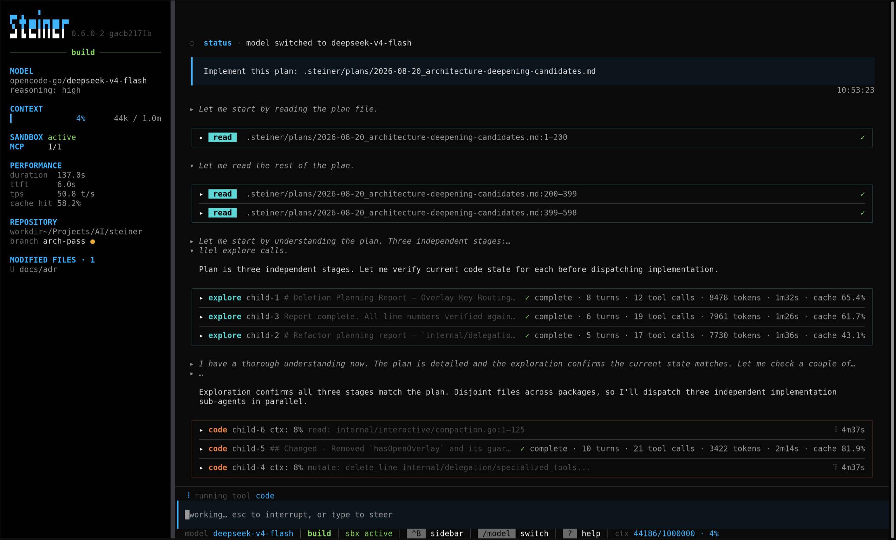

# steiner

A minimal, local-first Go coding agent with bounded context and sandboxed execution.

- **Delegation-first**: sub-agents isolate work so it never fills the parent conversation
- **Sandboxed execution**: bash and subprocess tools run inside a bubblewrap sandbox; sandbox violations prompt for user decision
- **Provider-agnostic**: same config shape for local and cloud providers



## Why steiner

Most coding agents are designed for cloud models with large context windows. Steiner is designed for the opposite constraint: local LLMs where context is expensive, reasoning quality degrades as the window fills, and you want to know exactly what is happening before anything changes on disk.

The core bet is that delegation is a better context strategy than summarisation. When a sub-agent handles exploration or code changes, the parent conversation never sees the intermediate turns — only the result. Combined with per-source byte budgets and late-stage compaction, this keeps the working context lean across long sessions.

By default, bash and subprocess tools run inside a sandbox that prevents writes outside the workspace and filters credential-bearing environment variables. Users can temporarily allow writable access to specific paths or disable sandboxing entirely with the `--unsafe` flag.

The provider/model split means you can point steiner at Ollama, LM Studio, OpenRouter, or a native Anthropic or OpenAI endpoint with the same config shape and the same tool behavior.

## Quickstart

1. **Prerequisites**: Go `1.25+`. For local models, [Ollama](https://ollama.com) or [LM Studio](https://lmstudio.ai).
2. **Start a local model** (Ollama example):
   ```bash
   ollama run qwen2.5-coder:14b
   ```
3. **Run from source**:
   ```bash
   go run ./cmd/steiner --exec "summarize this repository in one sentence"
   ```
   Or start interactive mode:
   ```bash
   go run ./cmd/steiner
   ```
4. **Inspect resolved configuration** before doing real work:
   ```bash
   go run ./cmd/steiner config
   ```
5. **Optional — build a local binary**:
   ```bash
   make build-binaries
   ./bin/steiner
   ```

## Usage

**Interactive mode** — launches the TUI, accepts natural-language requests, streams tool calls and responses:

```bash
go run ./cmd/steiner
# or
./bin/steiner
```

**Single-shot** — runs one request and exits:

```bash
go run ./cmd/steiner --exec "explain the auth package"
```

**Commands reference**:

| Command | What it does |
|---------|--------------|
| `version` | Print the build version; `--short` for script-friendly output |
| `config` | Print the resolved configuration (providers, models, limits) |
| `update` / `upgrade` | Self-update to the latest release; optionally specify a version |
| `tools` | List configured tools and their approval status |
| `skills` | List discovered skills |
| `--help` | Print all flags and usage |

### Output format

`steiner --version` and `steiner version` print a multi-line panel with
build metadata:

```
  version    v0.1.0
  commit     abc1234
  built      2026-06-17T12:00:00Z
  go         go1.25.0
  channel    stable
```

Labels are bold with the configured accent color; values use the default foreground. Use
`steiner version --short` to print only the raw version string (no styling,
no labels) for scripts and CI.

`steiner update` (alias `upgrade`) runs in two phases: **check** then **apply**.

```
  checking version
  Current:    v0.1.0
  Latest:     v0.2.0
  updating...
  ✔ updated
```

If already up to date, the apply phase is skipped:

```
  checking version
  Current:    v0.2.0
  Latest:     v0.2.0
  ✔ Up to date
```

When switching between dev and stable channels, a warning is shown:

```
  ⚠ notice   switching from dev to stable — this replaces your current build
  checking version
  …
```

A spinner animates during check and download. On a non-TTY or when `NO_COLOR` is
set, the spinner degrades to a static line.

## Configuration

Configuration is loaded in this precedence order (later overrides earlier):

1. Compiled defaults
2. `~/.config/steiner/config.yaml`
3. `.steiner/config.yaml` (project-local)
4. Environment variables with the `STEINER_` prefix
5. CLI flags

Model assignments use a required `models.profiles.default` baseline and named
partial overlays. The shared `models.definitions` registry holds model details:

```yaml
models:
  definitions:
    local:
      provider: local
      id: qwen2.5-coder:14b
    sonnet:
      provider: anthropic
      id: claude-sonnet-4-5
  profiles:
    default:
      default_model: local
      sub_agents:
        code: sonnet
    cloud:
      default_model: sonnet
```

Select a profile at startup with `--profile <name>` for interactive, `--exec`, or
oneshot runs:

```bash
steiner --profile cloud
steiner --profile cloud --exec "explain the auth package"
steiner --profile cloud oneshot "refactor the auth package"
```

Startup model precedence is selected profile, then `STEINER_MODEL`, then `--model`.
The env and CLI model overrides change only the active orchestrator model; profile
role assignments and `default_model` fallback remain in effect. In the TUI,
`/model` still changes only the active orchestrator. `/profile <name>` changes
future advisor, sub-agent, oneshot, and workflow-handoff assignments plus the
profile's `default_model` fallback, while preserving the current orchestrator
model, current `/model` override, conversation, and prompt-cache identity.
`/profile` requires a name and does not open a picker. Without a name it prints
`usage: /profile <name>`; an unknown or invalid profile reports an error and
leaves current selection unchanged.

**Example — local LLM (Ollama or LM Studio)**:

```yaml
providers:
  local:
    type: openai_compat
    base_url: http://localhost:11434/v1
models:
  discovery_enabled: true
  definitions:
    local:
      provider: local
      id: qwen2.5-coder:14b
  profiles:
    default:
      default_model: local
```

See [Configuration](docs/configuration.md) for all provider types, model fields, limit overrides, sandbox settings, sub-agent config, and environment variables.

## Model discovery

Steiner discovers available models from configured providers and adds them to the `/model` chooser. Discovery is enabled by default; set `models.discovery_enabled: false` to use configured entries only. Model references accept either a config alias or a raw `provider/model-id` reference, such as `openrouter/openai/gpt-4o`.

Use `steiner models refresh` to force discovery for every configured provider, or `steiner models status` to check each provider cache. The chooser orders models by popularity first, then configured aliases, then display name alphabetically.

See [Model enumeration](docs/model-enumeration.md) for provider details, caching, and model reference rules.

## Built-in tools

| Tool | Description |
|------|-------------|
| `read` | Read files with offset/limit pagination; preserves long lines up to its per-line cap, bounds per-page output, and continues via `next_offset`; detects and base64-encodes images |
| `mutate` | Apply structured file mutations atomically (create, write, replace, delete_file, move); parent directories must exist for workspace paths; `replace` against an existing file requires either a same-session read observation or an explicit `file_hash` — otherwise it is rejected before planning |
| `glob` | Find files by pattern |
| `grep` | Search file contents with surrounding context |
| `ls` | List directory contents |
| `bash` | Run shell commands (sandboxed by default) |
| `fetch_url` | Fetch a URL and return its content: HTML has its main content extracted and converted to markdown (falling back to the full document if extraction finds nothing), text formats (JSON, YAML, plain text, CSV, etc.) returned raw, images always saved to `.steiner/tmp/fetched` and available through the `read` tool; large responses saved to disk in full, with the `read` tool used to paginate. `.steiner/tmp/fetched` is pruned at startup: files older than 7 days are removed, then oldest-first until the directory is under 250MB (files younger than 1 hour are never evicted by the budget rule) |
| `display_file` | Show a file in the TUI overlay without adding to conversation |
| `advisor` | Ask a stronger-model steering advisor for guidance, optionally passing `question` and `files` for it to review (requires `advisor.enabled`) |
| `workflow_handoff` | Transition to a different workflow with approved artifacts |

MCP tools from connected servers appear alongside built-ins with the `mcp__<server>__<tool>` prefix.

## Sandboxing

By default, `bash` and subprocess tools run inside a Linux sandbox (using `bubblewrap`) that restricts writes to files outside the workspace and filters credential-bearing environment variables. The sandbox bind-mounts the entire host filesystem read-only (`--ro-bind / /`), with writable overlays for the workspace and a sandbox state directory (`.steiner/home/`). All installed toolchains, system libraries, and user config files are accessible read-only without per-path configuration.

Steiner also creates an ephemeral in-memory OpenSSH client-config overlay for sandboxed commands so `ssh` can read the system client config and static drop-ins without copying SSH config into the workspace. If OpenSSH still rejects the config inside the sandbox, Steiner can prompt to rerun the command outside the sandbox.

When a sandboxed tool attempts to write to a file outside the workspace, the user is prompted to either grant temporary access, use the `--unsafe` flag to disable sandboxing, or cancel the operation. This protects against accidental workspace-external writes and environment variable leakage. Reading host files (including on-disk credentials) is not restricted — sandboxing is not a confidentiality boundary, and private SSH keys are never copied into the workspace.

**Platform support**: Linux only (automatic detection; sandboxing is disabled on macOS and Windows). When sandboxing is unavailable or bypassed, the sandbox status is reported in the TUI and an optional warning banner is shown (see `sandbox.warning_on_unsupported_platform` in [Configuration](docs/configuration.md)). Bash and subprocess tools fall back to unsandboxed execution.

For configuration, environment variable filtering, mount layout, and troubleshooting, see [docs/tool-sandboxing.md](docs/tool-sandboxing.md).

## Context management

Local LLMs have limited context windows — often measured in tens of thousands of tokens, not millions. Every turn accumulates tokens from model output and tool results, and long contexts cost more while degrading reasoning quality. Steiner keeps the context window lean through three mechanisms, ordered by effectiveness.

**Delegation** is the primary strategy. Sub-agents isolate work from the parent conversation. The full turn-by-turn transcript of exploration, code changes, or research never enters the parent context at all — only the result comes back. This is the most effective mechanism because it prevents context growth rather than managing it after the fact.

**Per-source byte budgets** cap each context source (preamble, agent summaries, skills, tool results, conversation history) so no single category can crowd out the others. **Compaction** kicks in when estimated prompt tokens reach 70% of the context window: older turns are summarised by the model into a compact durable prefix, then dropped from the live history.

See [docs/context-management.md](docs/context-management.md) for the full reference.

For manual compaction, use `/compact` or `/compact <focus text>` to guide the summary. Bare `/compact` is unchanged. Auto-compaction does not use steering.

## Sub-agent delegation

Delegation is steiner's primary context management strategy. `steiner` exposes two sub-agent tools that delegate bounded tasks to isolated child agents. Sub-agent delegation is enabled by default — the model sees these tools alongside the built-ins, and its system prompt casts it as the orchestrator: it plans, dispatches, verifies, and integrates rather than doing the default implementation work itself.

The `sub_agent` tool accepts a structured brief with six required fields: `objective` (single outcome), `context` (why, how it fits, what's decided), `deliverable` (exact artifact or answer and its shape), `constraints` (boundaries and prohibited actions), `success_criteria` (observable completion conditions), and `checks` (applicable validations to run). These fields ensure complete hand-off between orchestrator and child.

| Tool | Type values | What it does | Can mutate? |
|------|-------------|--------------|-------------|
| `sub_agent` | `explore`, `research`, `code`, `evaluate`, `sanity_check`, `review`, `vision` | Dispatch a specialized sub-agent by type. | Only type `code` can mutate |
| `follow_up` | — | Resume an existing sub-agent session by agent ID with a new user message | No |

Type `code`, `review`, and `evaluate` children may additionally call `advisor` for stronger-model steering when `advisor.enabled` is true, capped per child by `advisor.max_uses_per_sub_agent`.

Delegation calls can fan out in parallel; configure the width with `sub_agent.max_parallel` (default `3`, minimum `1`, `1` serial). Ordinary parallel-safe tool calls (`read`, `glob`, `grep`, `ls`, `fetch_url`, `web_search`) are bounded separately by `limits.max_parallel_tools` (default `4`, minimum `1`). See [docs/sub-agent-delegation.md](docs/sub-agent-delegation.md) for full documentation, including per-agent tool allowlists and safety restrictions.

Every `sub_agent` type `code` automatically runs in its own isolated, runtime-provisioned git worktree under `.steiner/worktrees/`. Worktrees persist until explicitly pruned via the CLI: `steiner worktrees --list` (show all delegation worktrees), `steiner worktrees --prune <id>` (remove a worktree by its ID), or `steiner worktrees --prune-all` (remove all delegation worktrees).

In interactive TUI sessions, leftover delegate worktrees are offered for cleanup on exit when the session is idle; the offer only covers worktrees created by the current process.

## Execution modes

Interactive sessions run in `plan` or `build` mode. In `plan` mode project edits are restricted: `mutate` writes are limited to `.steiner/plans/`, `sub_agent` type `code` and any `follow_up` targeting a mutation-capable child are denied, and when the bubblewrap sandbox is active the rest of the project is bind-mounted read-only for `bash` as well. Plan artifacts may be written under `.steiner/plans/`. Plan mode doubles as a chat/Q&A mode: discuss freely, and write a plan file only when handing off. Call `workflow_handoff` to hand an approved plan off: `implement` and `review` start structured `/implement` and `/review` workflows from `overview.md` + `plan.yaml`, while `build` directly executes a standalone `plan.md` in build mode without skill discovery.

Switch modes with Shift+Tab, `/mode [plan|build]`, or by directly invoking a skill (`/plan` sets `plan` mode, invoking any other skill sets `build` mode). The mode never changes the system prompt prefix or tool definitions. A bracketed notice is prepended to every outgoing user message in both modes (sticky). These notices are stored in the conversation and maintained through prompt caching. The default mode is set by `modes.default` in config (`build` unless configured otherwise).

Use `/configure` for guided help with project-local or global Steiner configuration. Global edits remain subject to normal exact-path approval for `~/.config/steiner/config.yaml`. `/config` is separate: it displays the compiled configuration.

Without a working sandbox (`sandbox.enabled: false`, non-Linux, or `bwrap` unavailable), plan mode is an agent/tool policy, not a filesystem-level guarantee: `bash` runs unenforced, while the `mutate` write restriction and the sub-agent denials stay hard-gated regardless of sandbox state.

See [docs/execution-modes.md](docs/execution-modes.md) for the full enforcement matrix and persistence details.

## Canon drift checks

Go tests guard against the orchestration canon (`delegationInstructions` in `internal/prompt/system.go`) drifting out of sync with the skill and oneshot prompt files that describe delegation to the model.

The specialist roster is typed Go data (`internal/prompt/specialists.go`) and the `## Your sub-agents` table is rendered from it, so the table cannot diverge from the roster. On top of that:

- a roster vocabulary check in `internal/prompt/` flags consumer files that name a sub-agent or tool no longer in the roster;
- a companion test in `internal/delegation/` asserts the roster matches the registered `AgentType` constants;
- a gated-tool check asserts canon never names a tool that is not registered in every session it renders in;
- shared-block checks pin the prose that bundled skills, and the oneshot prompts, deliberately duplicate verbatim.

All run as part of `go test ./...`, and therefore as part of `make check`.

See [docs/canon-drift-checks.md](docs/canon-drift-checks.md) for what counts as canon, the consumer file list, and how to resolve a failing check.

## Image persistence

When you paste an image (Ctrl+V), steiner saves it to `.steiner/tmp/images/` and assigns it a session-unique ID (e.g. `img-1`). The TUI displays the ID, dimensions, size, and file path below the submitted message.

The strip placeholder — shown on subsequent turns when image data is omitted — includes the ID and file path so the model knows where to find the image. To re-examine it, call `sub_agent` with type `vision` and the image ID:

```
sub_agent(type: "vision", objective: "describe what color the button is", context: "...", deliverable: "...", constraints: [], success_criteria: [], checks: [], image_id: "img-1")
```

For follow-up questions about the same image, use `follow_up` with the `agent_id` returned by the initial type `vision` call — the image is already in the sub-agent's history and cached server-side.

The `vision` type requires a vision-capable model configured under the selected profile's `sub_agents.vision` assignment. Image files are deleted automatically when the agent exits.

## MCP

Connect Model Context Protocol servers to give the model access to external tools. MCP is enabled by default. Each server is configured with its own approval mode (ask, allow, deny) and the model sees registered tools alongside built-ins with the `mcp__` prefix.

```yaml
mcp:
  servers:
    context-mode:
      enabled: true
      command: npx
      args: [-y, context-mode]
      env:
        npm_config_cache: /tmp/npm-cache
    microsoft-learn:
      enabled: true
      transport: http
      url: https://learn.microsoft.com/api/mcp
```

See [MCP servers](docs/mcp.md) for the full reference.

MCP behaviour is covered by hermetic, CI-safe tests for both transports; live validation against real third-party servers is tracked in #438.

## Optional features

### Advisor

A stronger-model steering pass that reviews the live conversation and returns concise guidance. No tools, no mutation, no child loop.

```yaml
advisor:
  enabled: true
models:
  definitions:
    advisor-model:
      provider: local
      id: advisor-model
  profiles:
    default:
      default_model: default
      advisor: advisor-model
```

See [Advisor](docs/advisor.md) for configuration options and behavior reference.

### Cache hit rate tracking

Token-weighted prompt-cache hit rate, always-on with no configuration. Surfaces in the sidebar (orchestrator-only) and via the `/cache-stats` overlay command (blended across all sources), plus in sub-agent delegation tool boxes (cumulative for the child agent), advisor tool boxes (per call), and per-request summarizer cache rates in compaction banners. Records main agent model calls, sub-agent delegation traffic, and advisor traffic.

For headless runs, where the `/cache-stats` overlay is unavailable and the stored stats are hour-bucketed aggregates, set `STEINER_USAGE_TELEMETRY` to a file path to append one JSON line per model response with token counts and model identity. Off unless the variable is set, and it records no prompt or completion content.

See [Cache Stats](docs/cache-stats.md) for the metric definition, storage format, telemetry schema, and privacy notes.

### Oneshot mode

Autonomous three-phase orchestration (plan, implement, review). Each phase runs as a sub-agent in an isolated git worktree. Runs are resumable.

```yaml
oneshot:
  auto_pr: false
models:
  definitions:
    default:
      provider: local
      id: qwen3-35b-a3b
  profiles:
    default:
      default_model: default
      oneshot:
        plan: default
        implement: default
        review: default
```

See [Oneshot Mode](docs/oneshot.md) for invocation, configuration, and resume behaviour.

### Desktop notifications

Native notifications when the agent needs approval or handoff. Linux fully supported; macOS and Windows no-op with a startup warning.

```yaml
desktop_notifications:
  enabled: true
```

See [Desktop Notifications](docs/desktop-notifications.md) for platform support and configuration.

### Other features

These features are documented in [Optional Features](docs/optional-features.md):

- [**`cave_human`**](docs/optional-features.md#cave_human) — terse output with anti-AI-writing style instruction
- [**Accent colour**](docs/optional-features.md#accent-colour) — customizable TUI accent with 20 presets and `/accent` picker
- [**Web search**](docs/optional-features.md#web-search) — model-facing search tool with Google, Kagi, Brave, and SearXNG backends
- [**Image paste and recall**](docs/optional-features.md#image-paste) — Ctrl+V image input with auto-resize, token accounting, and vision sub-agent re-examination
- [**Conversation forking**](docs/optional-features.md#conversation-forking) — fork live or saved sessions into independent copies
- [**Code simplification**](docs/optional-features.md#code-simplification) — parallel sub-agent analysis for reuse, simplification, efficiency, and altitude
- [**Codex OAuth**](docs/optional-features.md#codex-oauth) — use OpenAI Codex subscription models without a separate API key
- [**MCP servers**](docs/mcp.md) — connect Model Context Protocol servers with per-server approval control

## Self-update

Steiner can self-update via the `update` (or `upgrade`) command. It fetches the
latest release from GitHub, verifies the binary checksum, and atomically
replaces the running executable.

A GitHub token is not strictly required, but GitHub API rate limits may apply
without one. Set `STEINER_GITHUB_TOKEN` in your environment to authenticate:

```bash
export STEINER_GITHUB_TOKEN=ghp_...
```

On interactive startup, steiner passively checks GitHub for a newer release (TTL-cached, at most once per `update_check.interval_hours`) and shows a sidebar nudge when one is available. Set `update_check.enabled: false` to disable.

### Specific version

Pass a version tag to install a specific stable release instead of the latest:

```bash
steiner update v1.2.0
steiner update 1.2.0     # "v" prefix is optional
```

### Dev channel

The `update` command selects the release channel via the `--dev` flag, which is
a root-level persistent flag and also works on the `update` subcommand:

```bash
# Stable channel (default): installs the latest stable release.
steiner update

# Dev channel: pulls the build published on every merge to main.
steiner update --dev
steiner --dev update
```

`--dev` selects the dev release channel; its absence selects the stable
channel. Both a dev build version string (`dev` or `dev-<sha>`) and a stable
semver (`vX.Y.Z`) honor the flag. The dev binary is always replaced with the
latest dev release; the stable binary is only replaced when a newer semver
is available.

When switching channels — dev to stable or stable to dev — a warning is
printed with the channel names highlighted in the accent colour. `--dev` and
a specific version cannot be used together.

## Development

```bash
# Build
go build ./...
make build-binaries

# Test
go test ./...
go test -race ./...

# Lint and vet
go vet ./...
golangci-lint run ./...

# All checks (lint + vet + format check)
make check

# Format
make fmt
```

For agent contributor context, architecture constraints, and conventions, see [AGENTS.md](AGENTS.md).
